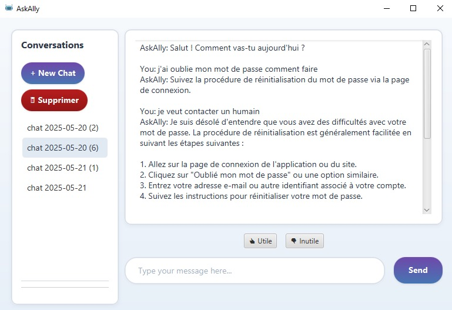

# AskAlly-Chatbot-
JavaFX Chatbot with Local LLM A desktop chatbot application built with JavaFX, powered by a local LLM (via Ollama) and backed by SQLite for persistent chat history.

Features
Local AI Chatbot: Runs entirely offline using Ollama-hosted LLMs (e.g., Llama 3, Mistral).

SQLite Database: Stores conversation history for retrieval and continuity.

JavaFX UI: Clean, responsive interface for seamless chatting.

Customizable: Easily switch between different local LLM models.

